# Yöresel Lezzetler Web Sitesi Planlama Dokümanı

Bu doküman projenin ilk mimari rehberidir. Amaç, geliştirmeye başlamadan önce kullanıcı akışlarını, veri modelini, sistem mimarisini, sayfa yapısını, SEO hedeflerini ve sınıf/bileşen ilişkilerini netleştirmektir.

## Kullanılacak Araçlar ve Nedenleri

### React

React, arayüzü küçük ve tekrar kullanılabilir component'lere bölmemizi sağlar. Bu projede `TurkeyMap`, `FoodCard`, `RestaurantMap`, `ReviewForm`, `Navbar`, `Footer` gibi parçalar React component'i olarak geliştirilecek.

Kullanım mantığı:

- Sayfalar `src/pages` altında tutulur.
- Ortak parçalar `src/components` altında tutulur.
- Veriyi Firestore'dan almak için özel hook'lar kullanılır: `useFoods`, `useRestaurants`, `useReviews`.

### Tailwind CSS

Tailwind, CSS class'ları ile hızlı ve tutarlı tasarım yapmamızı sağlar. Örneğin `flex`, `grid`, `rounded`, `text-sm`, `bg-white`, `shadow` gibi class'lar doğrudan JSX içinde kullanılır.

Bu projede Tailwind:

- Harita üzeri tooltip tasarımlarında,
- Kart listelerinde,
- Giriş/kayıt formlarında,
- Admin panel tablolarında kullanılacak.

### react-simple-maps

Türkiye haritasını SVG tabanlı çizmek ve bölgeleri renklendirmek için kullanılacak. SVG harita üzerinde her şehir veya bölge tıklanabilir alan gibi davranabilir.

Bu projedeki görevi:

- Türkiye haritasını göstermek,
- 7 coğrafi bölgeyi farklı renklendirmek,
- Bölge seçilince zoom hissi vermek,
- Bölgeye ait şehirleri etkileşimli hale getirmek.

### Leaflet.js ve React Leaflet

Leaflet, gerçek harita üzerinde restoran konumlarını pin ile göstermek için kullanılacak. `react-simple-maps` Türkiye'nin seçim haritası için, Leaflet ise restoranların gerçek koordinatlı haritası için daha uygundur.

Bu projedeki görevi:

- Şehir detayında restoran pinlerini göstermek,
- Restoran puanı, yorum sayısı ve adres bilgisini popup içinde göstermek,
- Kullanıcıyı restoran detayına yönlendirmek.

### Firebase Auth

Kullanıcı kayıt ve giriş işlemlerini yönetir. E-posta/şifre ile kayıt, giriş, çıkış ve oturum takibi bu servis üzerinden yapılır.

Bu projedeki görevi:

- Kayıt olma,
- Giriş yapma,
- Kullanıcı oturumunu takip etme,
- Admin/kullanıcı rol ayrımını destekleme.

### Firebase Firestore

Firestore, verileri koleksiyon ve doküman mantığıyla saklayan NoSQL veritabanıdır. SQL'deki tablo yerine `regions`, `cities`, `foods`, `restaurants`, `reviews`, `users` gibi koleksiyonlar kullanılır.

Bu projedeki görevi:

- Bölgeleri, şehirleri, lezzetleri, restoranları ve yorumları saklamak,
- Ana sayfadaki en sevilen lezzetleri ve en yüksek puanlı restoranları listelemek,
- Admin panelinde verileri yönetmek.

### Firebase Cloud Functions

Cloud Functions, kullanıcıya doğrudan vermememiz gereken güvenli işlemleri backend tarafında çalıştırır.

Bu projedeki görevi:

- Kullanıcı rolü atamak,
- Admin yetkisini güvenli şekilde kontrol etmek,
- Puan ortalamalarını otomatik güncellemek,
- Yorum eklendiğinde restoran/lezzet istatistiklerini hesaplamak.

### Vercel

React frontend'i yayınlamak için kullanılacak hosting servisidir. Firebase backend servisleri ayrı çalışır, Vercel ise kullanıcıya görünen web sitesini yayınlar.

## Önerilen Proje Dosya Dizini

Mevcut dizin bu mimariye yakındır. Geliştirme ilerledikçe aşağıdaki yapı korunabilir.

```text
yoresel_lezzetler/
  public/
    maps/
      turkey-topojson.json
    images/
  src/
    components/
      food/
        FoodCard.jsx
        FoodTooltip.jsx
      home/
        HeroBanner.jsx
        RecentReviews.jsx
        TopFoods.jsx
        TopRestaurants.jsx
      map/
        TurkeyMap.jsx
        RegionLayer.jsx
        CityLayer.jsx
        RestaurantMap.jsx
      restaurant/
        RestaurantCard.jsx
        RestaurantPin.jsx
        ReviewCard.jsx
      UI/
        LoadingSpinner.jsx
        ReviewForm.jsx
        StarRating.jsx
      Navbar.jsx
      Footer.jsx
      ProtectedRoute.jsx
    context/
      AuthContext.jsx
    firebase/
      config.js
      auth.js
      firestore.js
    hooks/
      useRegions.js
      useFoods.js
      useRestaurants.js
      useReviews.js
    pages/
      HomePage.jsx
      RegionPage.jsx
      CityPage.jsx
      FoodDetailPage.jsx
      RestaurantPage.jsx
      LoginPage.jsx
      RegisterPage.jsx
      admin/
        AdminPage.jsx
        AdminUsers.jsx
        AdminFoods.jsx
        AdminRestaurants.jsx
        AdminReviews.jsx
    routes/
      AppRoutes.jsx
    App.jsx
    index.js
  functions/
    index.js
    package.json
  docs/
    project-planning.md
```


## 1. User Flows

### Ziyaretçi Ana Akışı

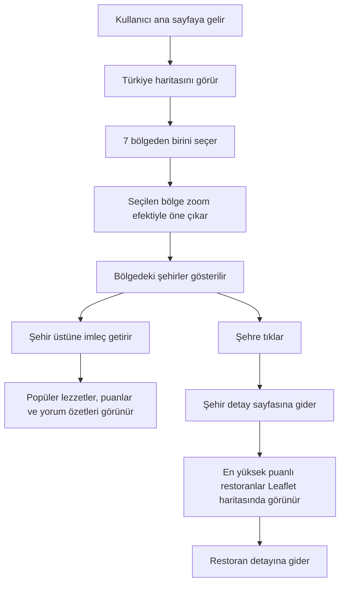

### Kayıt ve Giriş Akışı

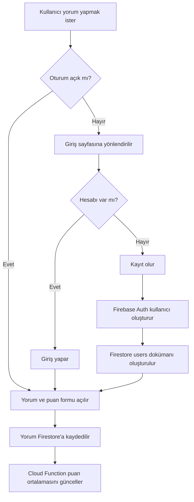

### Şehir ve Restoran Keşif Akışı

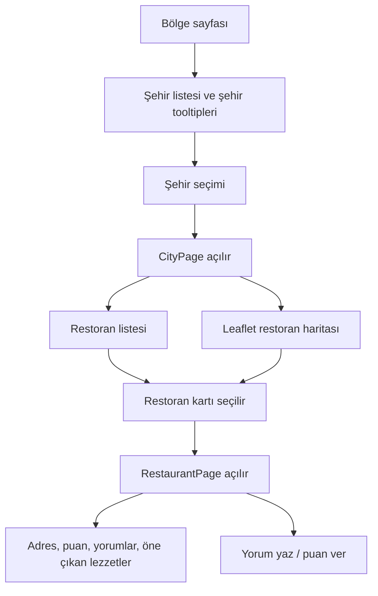

### Admin Akışı

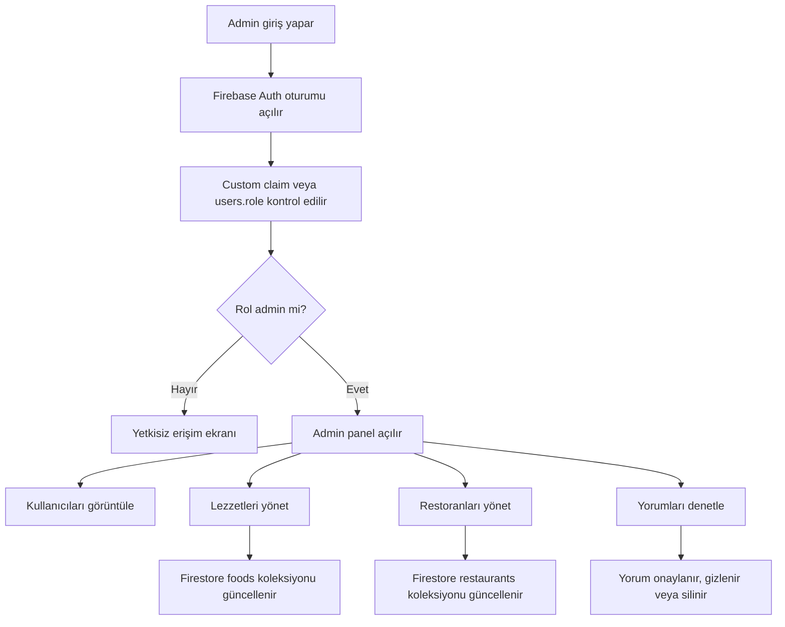

## 2. ERD ve System Architecture Diagrams

Firestore NoSQL olduğu için bu ERD fiziksel SQL şeması değildir. İlişkileri anlamak için mantıksal model olarak kullanılmalıdır.

### Firestore Mantıksal ERD

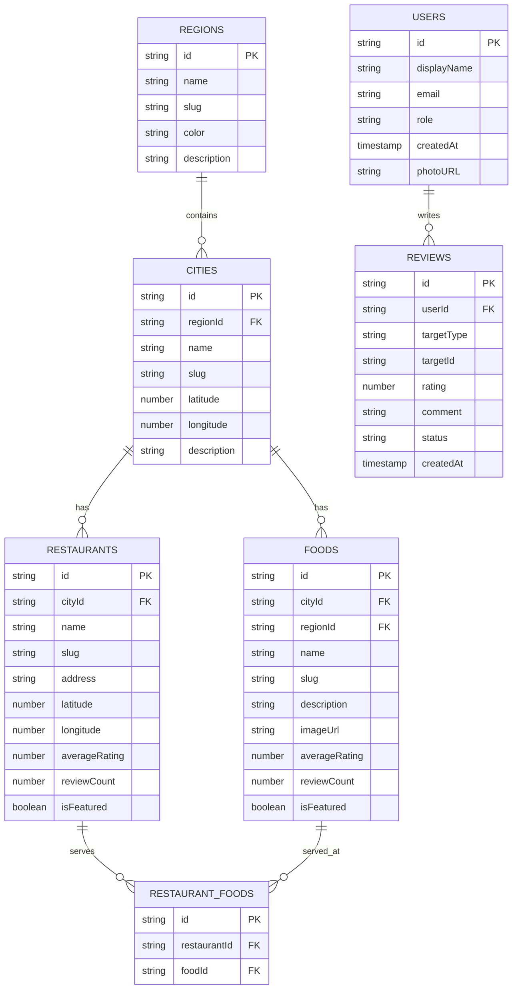

### Firestore Koleksiyon Planı

```text
regions/{regionId}
  name, slug, color, description

cities/{cityId}
  regionId, name, slug, latitude, longitude, description

foods/{foodId}
  cityId, regionId, name, slug, description, imageUrl,
  averageRating, reviewCount, isFeatured

restaurants/{restaurantId}
  cityId, name, slug, address, latitude, longitude,
  averageRating, reviewCount, isFeatured

restaurantFoods/{restaurantFoodId}
  restaurantId, foodId

reviews/{reviewId}
  userId, targetType, targetId, rating, comment, status, createdAt

users/{userId}
  displayName, email, role, photoURL, createdAt
```

`targetType` değeri `food` veya `restaurant` olabilir. Böylece aynı `reviews` koleksiyonu hem lezzet hem restoran yorumlarını taşıyabilir.

### System Architecture Diagram

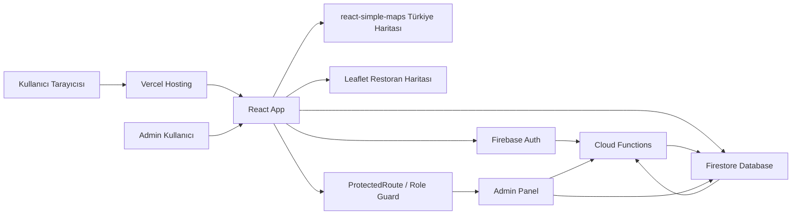

### Review Ekleme Sequence Diagram

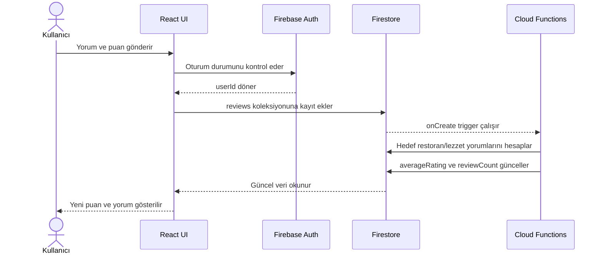

### Admin Yetki Sequence Diagram

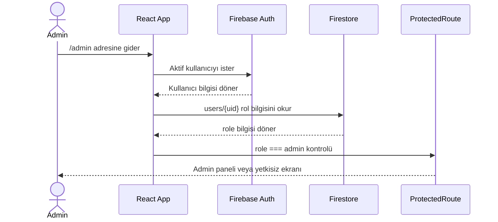

## 3. Sitemap

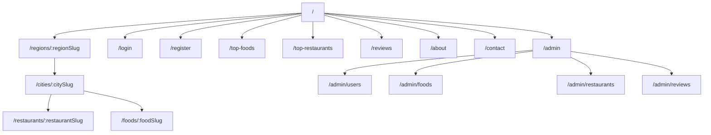

### Sayfa Listesi

| Route | Sayfa | Amaç |
| --- | --- | --- |
| `/` | Ana Sayfa | Türkiye haritası, popüler lezzetler, en yüksek puanlı restoranlar, yorum önizlemeleri |
| `/regions/:regionSlug` | Bölge Sayfası | Seçilen bölgedeki şehirleri ve öne çıkan lezzetleri gösterir |
| `/cities/:citySlug` | Şehir Sayfası | Şehirdeki lezzetleri ve restoranları listeler |
| `/foods/:foodSlug` | Lezzet Detay | Lezzet açıklaması, puanlar, yorumlar, bu lezzeti sunan restoranlar |
| `/restaurants/:restaurantSlug` | Restoran Detay | Konum, puan, yorumlar, sunulan lezzetler |
| `/login` | Giriş | Firebase Auth ile giriş |
| `/register` | Kayıt | Firebase Auth ile hesap oluşturma |
| `/top-foods` | En Sevilen Lezzetler | SEO için liste sayfası |
| `/top-restaurants` | En Yüksek Puanlı Restoranlar | SEO ve keşif için liste sayfası |
| `/reviews` | Kullanıcı Yorumları | Son yorumlar ve sosyal kanıt |
| `/admin` | Admin Panel | Yönetim özeti |
| `/admin/users` | Kullanıcı Yönetimi | Kullanıcıları ve rolleri görüntüleme |
| `/admin/foods` | Lezzet Yönetimi | Lezzet ekleme/düzenleme |
| `/admin/restaurants` | Restoran Yönetimi | Restoran ekleme/düzenleme |
| `/admin/reviews` | Yorum Yönetimi | Yorum onayı, gizleme, silme |

## 4. SEO Keyword Mapping Plan

Bu plan canlı arama hacmi verisi içermez. Yayına yaklaşırken Google Keyword Planner, Google Trends ve Search Console ile doğrulama yapılmalıdır.

### Ana SEO Stratejisi

- Ana sayfa geniş anahtar kelimeleri hedefler.
- Bölge sayfaları bölgesel yemek aramalarını hedefler.
- Şehir sayfaları şehir + yöresel lezzet aramalarını hedefler.
- Lezzet detay sayfaları spesifik yemek aramalarını hedefler.
- Restoran sayfaları şehir + restoran + yemek niyetini hedefler.

### Keyword Mapping Tablosu

| Sayfa | Primary Keyword | Secondary Keywords | Search Intent | Önerilen Title |
| --- | --- | --- | --- | --- |
| `/` | yöresel lezzetler | Türkiye yöresel yemekleri, meşhur yemekler, en iyi restoranlar | Keşif | Türkiye'nin Yöresel Lezzetleri ve En İyi Restoranları |
| `/regions/karadeniz-bolgesi` | Karadeniz yöresel lezzetleri | Karadeniz yemekleri, Karadeniz restoranları | Bölgesel keşif | Karadeniz Bölgesi Yöresel Lezzetleri |
| `/regions/ege-bolgesi` | Ege yöresel lezzetleri | Ege yemekleri, Ege mutfağı | Bölgesel keşif | Ege Bölgesi Yöresel Lezzetleri |
| `/regions/marmara-bolgesi` | Marmara yöresel lezzetleri | Marmara yemekleri, Marmara restoranları | Bölgesel keşif | Marmara Bölgesi Yöresel Lezzetleri |
| `/regions/ic-anadolu-bolgesi` | İç Anadolu yöresel lezzetleri | İç Anadolu yemekleri, Ankara yöresel lezzetleri | Bölgesel keşif | İç Anadolu Bölgesi Yöresel Lezzetleri |
| `/regions/dogu-anadolu-bolgesi` | Doğu Anadolu yöresel lezzetleri | Doğu Anadolu yemekleri, Erzurum cağ kebabı | Bölgesel keşif | Doğu Anadolu Bölgesi Yöresel Lezzetleri |
| `/regions/guneydogu-anadolu-bolgesi` | Güneydoğu Anadolu yöresel lezzetleri | Gaziantep yemekleri, Şanlıurfa lezzetleri | Bölgesel keşif | Güneydoğu Anadolu Yöresel Lezzetleri |
| `/regions/akdeniz-bolgesi` | Akdeniz yöresel lezzetleri | Akdeniz yemekleri, Antalya restoranları | Bölgesel keşif | Akdeniz Bölgesi Yöresel Lezzetleri |
| `/cities/gaziantep` | Gaziantep yöresel lezzetleri | Gaziantep baklava, Antep kebabı, Gaziantep restoranları | Şehir keşfi | Gaziantep Yöresel Lezzetleri ve Restoranları |
| `/cities/erzurum` | Erzurum yöresel lezzetleri | cağ kebabı, Erzurum restoranları | Şehir keşfi | Erzurum Yöresel Lezzetleri ve Restoranları |
| `/foods/cag-kebabi` | cağ kebabı | cağ kebabı nerede yenir, Erzurum cağ kebabı | Yemek detayı | Cağ Kebabı Nerede Yenir? |
| `/restaurants/:restaurantSlug` | restoran adı | şehir restoran yorumları, restoran puanı | Yerel karar | Restoran Adı: Puan, Yorum ve Konum |
| `/top-foods` | Türkiye'nin en sevilen yemekleri | en popüler yöresel yemekler, meşhur Türk yemekleri | Liste/keşif | Türkiye'nin En Sevilen Yöresel Lezzetleri |
| `/top-restaurants` | en iyi yöresel restoranlar | en yüksek puanlı restoranlar, şehir restoranları | Liste/karar | Türkiye'nin En Yüksek Puanlı Yöresel Restoranları |

### SEO İçerik Kuralları

- Her şehir sayfasında en az 300-600 kelimelik özgün açıklama hedeflenmeli.
- Her lezzet sayfasında yemek açıklaması, şehir bağlantısı, restoran bağlantısı ve kullanıcı yorumları bulunmalı.
- Restoran sayfalarında `LocalBusiness` schema markup kullanılmalı.
- Lezzet sayfalarında `Article` veya uygun olduğunda `Recipe` schema markup düşünülebilir.
- Breadcrumb kullanılmalı: `Ana Sayfa > Bölge > Şehir > Lezzet`.
- URL'ler Türkçe karakter içermeden slug formatında olmalı: `icli-kofte`, `cag-kebabi`, `gaziantep`.

## 5. Class Diagramları

React projesinde klasik anlamda çok fazla class yazmayacağız. Modern React fonksiyon component'leri ve hook'lar ile geliştirilir. Yine de domain modelini ve component ilişkilerini class diagram gibi göstermek mimariyi anlamayı kolaylaştırır.

### Domain Model Class Diagram

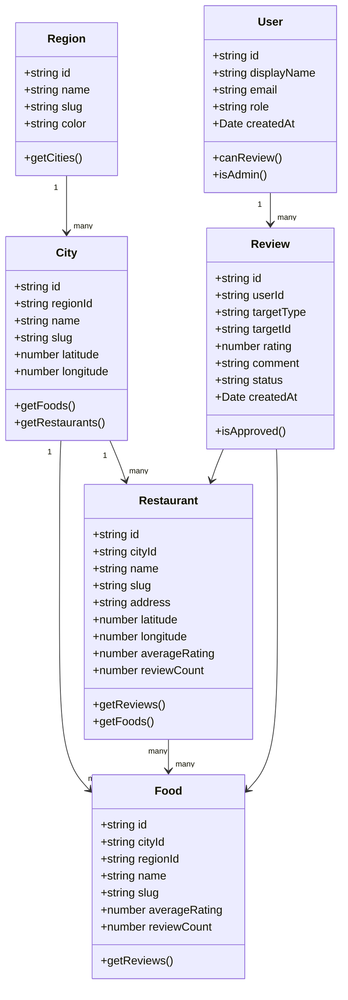

### React Component Diagram

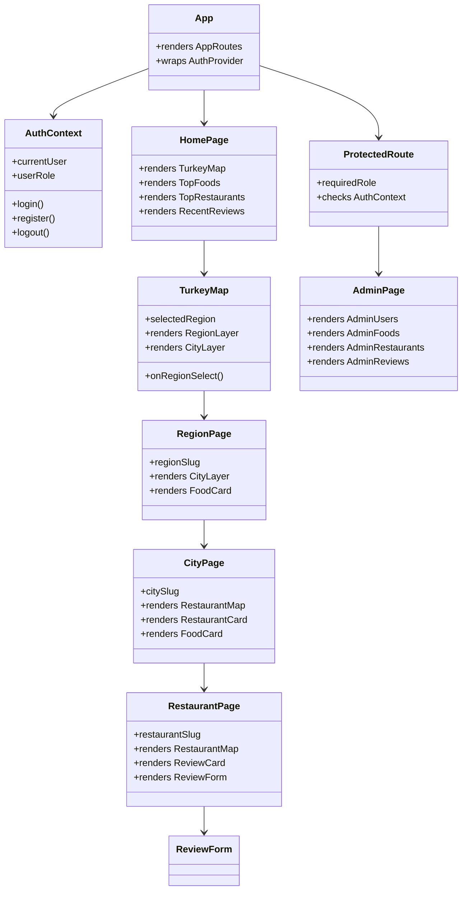

### Hook ve Servis İlişkileri

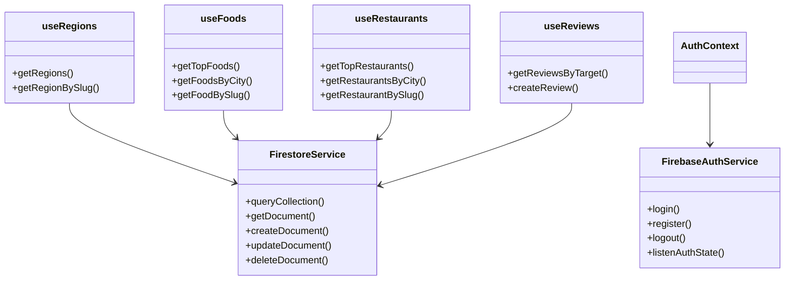

## İlk Geliştirme Sırası

1. Firebase config, AuthContext ve route yapısı.
2. Firestore koleksiyon seed verileri: bölgeler, şehirler, örnek lezzetler.
3. Ana sayfa Türkiye haritası ve bölge seçimi.
4. Bölge/şehir sayfaları.
5. Restoran haritası ve restoran detayları.
6. Kayıt/giriş ve yorum formu.
7. Cloud Functions ile rol ve puan hesaplama.
8. Admin panel.
9. SEO başlıkları, meta açıklamaları, sitemap ve schema markup.

## Mini Quiz

1. `react-simple-maps` ile `Leaflet` arasındaki temel fark nedir?
2. Firestore'da neden klasik SQL tablosu yerine koleksiyon/doküman yapısı kullanıyoruz?
3. Kullanıcı yorumu eklendiğinde puan ortalamasını neden frontend'de değil Cloud Functions tarafında hesaplamak daha güvenlidir?

