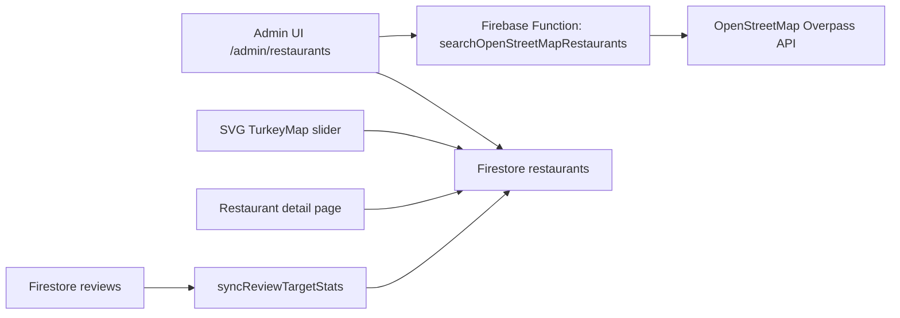
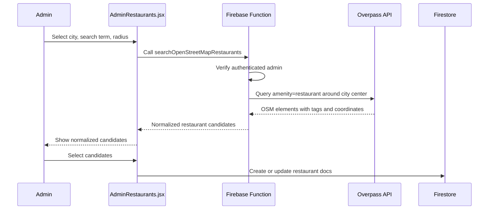

# Restaurant Location API Import Plan

## Goal

Admin should not enter every restaurant location by hand. The admin panel calls a Firebase Callable Function, the function searches OpenStreetMap through Overpass API, and the admin imports only the selected candidates into Firestore.

## Architecture

## Sequence

## Field Mapping

| OpenStreetMap field | Firestore restaurant field |
| --- | --- |
| `element.type + element.id` | `sourcePlaceId` |
| `tags.name` | `name` |
| `addr:*` tags | `address` |
| `lat` or `center.lat` | `location[0]`, `geoPoint.latitude` |
| `lon` or `center.lon` | `location[1]`, `geoPoint.longitude` |
| `tags.cuisine` | `cuisine`, `externalTypes` |
| `tags.website` / `contact:website` | `website` |
| `tags.phone` / `contact:phone` | `phone` |

The import intentionally does not use third-party rating or review data. New imported restaurants start with `averageRating: 0` and `reviewCount: 0`; existing imported restaurants keep their review stats because updates are merged without overwriting those fields.

## Usage Notes

This is an admin-only import flow. The browser does not call Overpass directly; it calls `searchOpenStreetMapRestaurants`, which prevents production-domain CORS issues and keeps the external API surface behind an authenticated admin check. Deploy the Firebase Function together with the web build before using this feature on the live domain. The public user experience reads Firestore only; it does not query Overpass on every map click.

Overpass is a free community service. Keep the tool admin-only, use small limits, and import results into Firestore instead of repeatedly querying Overpass.
